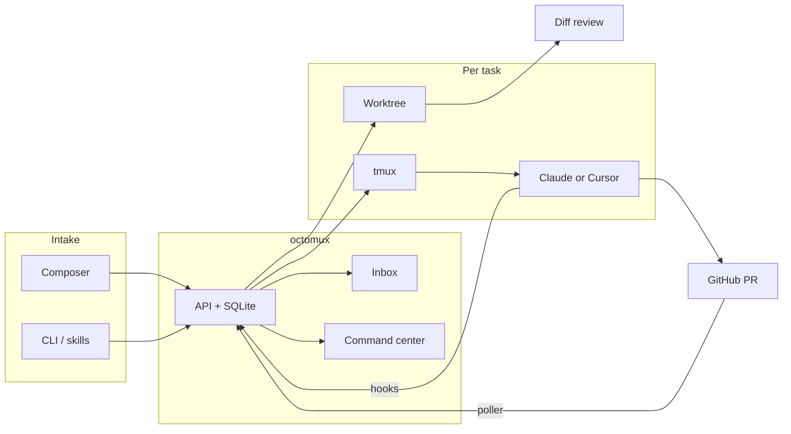

[](https://www.npmjs.com/package/octomux)
[](LICENSE)
[](https://github.com/ShreyPaharia/octomux)

# octomux

> **Coding got faster. Managing agents didn't.**

A local web app for running your **Claude Code** and **Cursor** agents in parallel — and reviewing what they shipped. Kanban for fleet status. One inbox for every "allow this tool?" prompt. In-app diff review with **Ship**. Runs entirely on your laptop.

```bash
npm install -g octomux && octomux init && cd your-repo && octomux start
```

Open [http://localhost:7777](http://localhost:7777) — describe a task in the composer, pick **Claude Code** or **Cursor**, and watch agents work in place.

## What you stop doing

Running agents in separate terminal tabs doesn't scale. octomux compresses the loop from dispatch to merge:

- **Triage** — every "allow this tool?" prompt lands in one inbox, not ten tmux panes
- **Status** — kanban shows what every agent is doing at a glance: draft, running, ready, shipped
- **Review** — diff lives in-app; mark files reviewed, queue inline comments, hit **Ship**
- **Ticket flow** — pull from Jira or GitHub; PRs auto-link; tasks auto-close on merge

Code never leaves your machine. No telemetry, no cloud sync. Crash, reboot, close the lid — `octomux start` restores every task, branch, and session.

## Screenshots

|                                                                               |                                                            |
| ----------------------------------------------------------------------------- | ---------------------------------------------------------- |
| **Home inbox + composer** — permission prompts, recent activity, dispatch bar |              |
| **Command center** — kanban from backlog → done                               |    |
| **Harness picker** — Claude Code or Cursor per task                           |  |
| **Settings** — default harness, Cursor model & `--force`                      |      |
| **Task cockpit** — agent tabs, live Claude session, Ship, Done                |          |
| **Diff review** — file tree, reviewed state, inline comments                  |                 |

## Features

- **Sessions inbox** — every permission prompt and question lands in one place; reply once, agents keep going. Tab title shows `(N) octomux` when something needs you.
- **Command center** — kanban for backlog → done; drag status, archive, workflow from draft → ship.
- **In-app diff review** — compare to `main`, mark files reviewed, queue inline comments, open lazygit in-editor.
- **Dual harnesses** — run **Claude Code** (`claude`) or **Cursor** (`cursor-agent`) per task; mix agents on one task via **Add agent**.
- **Worktrees keep agents off each other** — each task gets its own git worktree and `agents/<task-id>` branch; five agents can edit `auth.ts` at the same time without conflicts on your main tree.
- **Live terminals** — xterm.js streams each agent's tmux pane; attach the same session from the CLI if you prefer.
- **Agents that dispatch agents** — `/create-task`, `/list-tasks`, `/send-agent-message` skills work inside any Claude Code window; recursive dispatch from inside an agent.
- **Integrations** — Jira wiring plus orchestrator skills for GitHub / auto-review intake.
- **CLI ↔ dashboard parity** — `octomux create-task`, `send-message`, `resume-task` — same tasks the UI shows.
- **Reboot-proof** — WAL SQLite + preserved worktrees across restarts.
- **Local-only** — no telemetry, no cloud sync, no analytics. Your `.env` stays on the host.

## Quick start

```bash
brew install tmux git
npm install -g @anthropic-ai/claude-code    # and/or Cursor CLI
npm install -g octomux
octomux init
cd your-project
octomux start
```

```bash
octomux create-task -t "Add OAuth login" -r .
octomux create-task -t "Spike with Cursor" -r . --harness cursor
```

Step-by-step setup, Jira, and orchestrator skills: [ONBOARDING.md](./ONBOARDING.md)

## How it works

```
DISPATCH → BRANCH → CODE → INBOX → REVIEW → MERGE
```

| Phase        | What happens                                                                |
| ------------ | --------------------------------------------------------------------------- |
| **Dispatch** | Composer, CLI, orchestrator skills, or Jira/GitHub drafts                   |
| **Branch**   | Automatic git worktree + `agents/<task-id>` branch                          |
| **Code**     | tmux session per task; harness launches `claude` or `cursor-agent`          |
| **Inbox**    | Every permission prompt or question collects in one place                   |
| **Review**   | Diff tab, lazygit terminal, mark files reviewed, **Ship** / **Done**        |
| **Merge**    | PR poller links branches; tasks close when their PRs merge                  |
| _Recovery_   | DB + worktrees survive reboot — `octomux start` picks up where you left off |

## CLI

| Command                              | Description                                              |
| ------------------------------------ | -------------------------------------------------------- |
| `octomux start`                      | Dashboard at `:7777`                                     |
| `octomux init`                       | Defaults wizard (Jira, base branch, harness prefs)       |
| `octomux create-task`                | New task (`--harness cursor` optional)                   |
| `octomux list-tasks` / `get-task`    | Inspect tasks                                            |
| `octomux close-task` / `delete-task` | Stop or fully remove                                     |
| `octomux resume-task`                | Resume a closed task                                     |
| `octomux add-agent`                  | Another agent window                                     |
| `octomux send-message`               | Message a running agent — course-correct without restart |

## Architecture



## Requirements

- macOS (ARM64 or x64), Node.js 20+
- `tmux`, `git`
- At least one harness: **Claude Code** (`claude`) and/or **Cursor CLI** (`cursor-agent`)
- Recommended: `lazygit`, `neovim`

## Configuration

| Variable / flag           | Purpose                          |
| ------------------------- | -------------------------------- |
| `OCTOMUX_PORT` / `--port` | Dashboard port (default `7777`)  |
| `OCTOMUX_URL`             | CLI → API base URL               |
| `OCTOMUX_DB_PATH`         | Override task DB path            |
| `OCTOMUX_GITHUB_LOGIN`    | Reviewer-request polling account |

## FAQ

**What's the difference between octomux and just running tmux + Claude Code?**
octomux adds the kanban, the inbox, and diff review on top. tmux is just plumbing underneath.

**Does it work with Cursor?**
Yes. Pick Claude Code or Cursor per task. Mix them on the same task with **Add agent**.

**What happens if two agents touch the same file?**
They can't — each task runs in its own git worktree on its own branch. Five agents can edit `auth.ts` at the same time without conflicts on your main tree.

**What if my laptop reboots or crashes?**
Run `octomux start`. Tasks, branches, terminals, and review state all come back.

**How do I track what each agent is costing me?**
Each agent's tmux session has its own session log; Claude Code and Cursor both emit token usage there. A first-class cost view in the dashboard is on the roadmap.

## Links

- [GitHub](https://github.com/ShreyPaharia/octomux) · [npm](https://www.npmjs.com/package/octomux) · [octomux.dev](https://octomux.dev)

Issues and PRs welcome.
