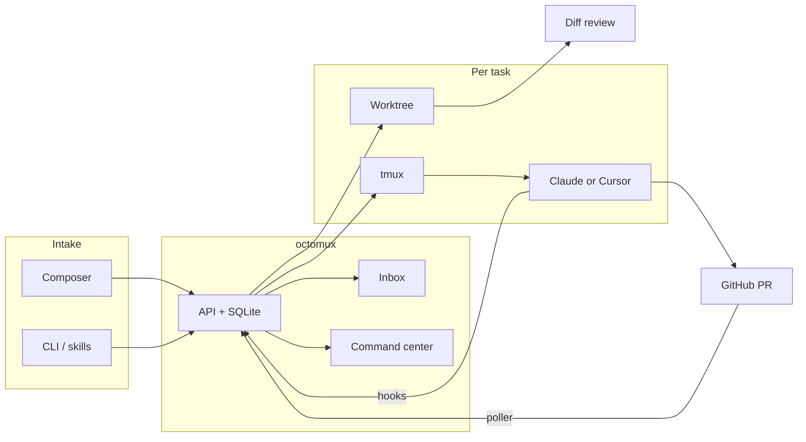

[](https://www.npmjs.com/package/octomux)
[](LICENSE)
[](https://github.com/ShreyPaharia/octomux)

# octomux

**Mission control for Claude Code and Cursor agents** — spin up isolated worktrees, run real agent sessions in tmux, and supervise everything from one dashboard until you’re ready to ship. Terminals, an inbox when agents need you, kanban for the fleet, and in-app diff review before merge.

```bash
npm install -g octomux && octomux init && cd your-repo && octomux start
```

Open [http://localhost:7777](http://localhost:7777) — describe a task in the composer, pick **Claude Code** or **Cursor**, and watch agents work in place.

## Why octomux?

Running agents in separate terminal tabs doesn’t scale. octomux gives you a repeatable loop from dispatch to merge:

- **Isolated** — Each task gets its own git worktree, branch, and tmux session. Parallel agents don’t stomp the same tree.
- **Supervised** — Permission prompts land in a **Sessions inbox**; reply once and the agent resumes. No polling twenty panes for “allow this tool?”
- **Reviewable** — Diff tab, per-file reviewed state, inline comments, and **Ship** / **Done** when the branch is ready — without leaving the dashboard.

One SQLite-backed state machine survives reboots: `octomux start` recovers tasks, worktrees, and sessions.

## Screenshots

| | |
| --- | --- |
| **Home inbox + composer** — permission prompts, recent activity, dispatch bar |  |
| **Command center** — kanban from backlog → done |  |
| **Harness picker** — Claude Code or Cursor per task |  |
| **Settings** — default harness, Cursor model & `--force` |  |
| **Task cockpit** — agent tabs, live Claude session, Ship, Done |  |
| **Diff review** — file tree, reviewed state, inline comments |  |

## Features

- **Dual harnesses** — Run **Claude Code** (`claude`) or **Cursor** (`cursor-agent`) per task; mix agents on one task via **Add agent**
- **Git worktree isolation** — Automatic worktree + `agents/<task-id>` branch per task; safe parallel work on one repo
- **Live terminals** — xterm.js streams each agent’s tmux pane; attach the same session from the CLI if you prefer
- **Sessions inbox** — Human-in-the-loop for permission prompts; tab title shows `(N) octomux` when something needs you
- **Command center** — Kanban columns, drag status, archive, workflow from draft → ship
- **In-app diff review** — Compare to `main`, mark files reviewed, queue comments, open lazygit in-editor
- **Integrations** — Jira wiring plus orchestrator skills for GitHub / auto-review intake
- **CLI + dashboard** — `octomux create-task`, `send-message`, `resume-task` — same tasks the UI shows
- **Recovery** — WAL SQLite + preserved worktrees across restarts

## Quick start

```bash
brew install tmux git
npm install -g @anthropic-ai/claude-code    # and/or Cursor CLI
npm install -g octomux
octomux init
cd your-project
octomux start
```

```bash
octomux create-task -t "Add OAuth login" -r .
octomux create-task -t "Spike with Cursor" -r . --harness cursor
```

Step-by-step setup, Jira, and orchestrator skills: [ONBOARDING.md](./ONBOARDING.md)

## How it works

```
INTAKE → EXECUTE → SUPERVISE → REVIEW → MERGE → RESUME
```

| Phase | What happens |
| ----- | ------------ |
| **Intake** | Composer, CLI, orchestrator skills, or Jira/GitHub drafts |
| **Execute** | Worktree + branch + tmux; harness launches `claude` or `cursor-agent` |
| **Supervise** | Inbox for permissions; command center for fleet status |
| **Review** | Diff tab, lazygit terminal, mark reviewed, **Done** |
| **Merge** | PR poller links branches; tasks close when PRs merge |
| **Resume** | DB + worktrees survive reboot — `octomux start` picks up |

## CLI

| Command | Description |
| ------- | ----------- |
| `octomux start` | Dashboard at `:7777` |
| `octomux init` | Defaults wizard (Jira, base branch, harness prefs) |
| `octomux create-task` | New task (`--harness cursor` optional) |
| `octomux list-tasks` / `get-task` | Inspect tasks |
| `octomux close-task` / `delete-task` | Stop or fully remove |
| `octomux resume-task` | Resume a closed task |
| `octomux add-agent` | Another agent window |
| `octomux send-message` | Message a running agent |

## Architecture



## Requirements

- macOS (ARM64 or x64), Node.js 20+
- `tmux`, `git`
- At least one harness: **Claude Code** (`claude`) and/or **Cursor CLI** (`cursor-agent`)
- Recommended: `lazygit`, `neovim`

## Configuration

| Variable / flag | Purpose |
| --------------- | ------- |
| `OCTOMUX_PORT` / `--port` | Dashboard port (default `7777`) |
| `OCTOMUX_URL` | CLI → API base URL |
| `OCTOMUX_DB_PATH` | Override task DB path |
| `OCTOMUX_GITHUB_LOGIN` | Reviewer-request polling account |

## Links

- [GitHub](https://github.com/ShreyPaharia/octomux) · [npm](https://www.npmjs.com/package/octomux) · [octomux.com](https://octomux.com)

Issues and PRs welcome.
