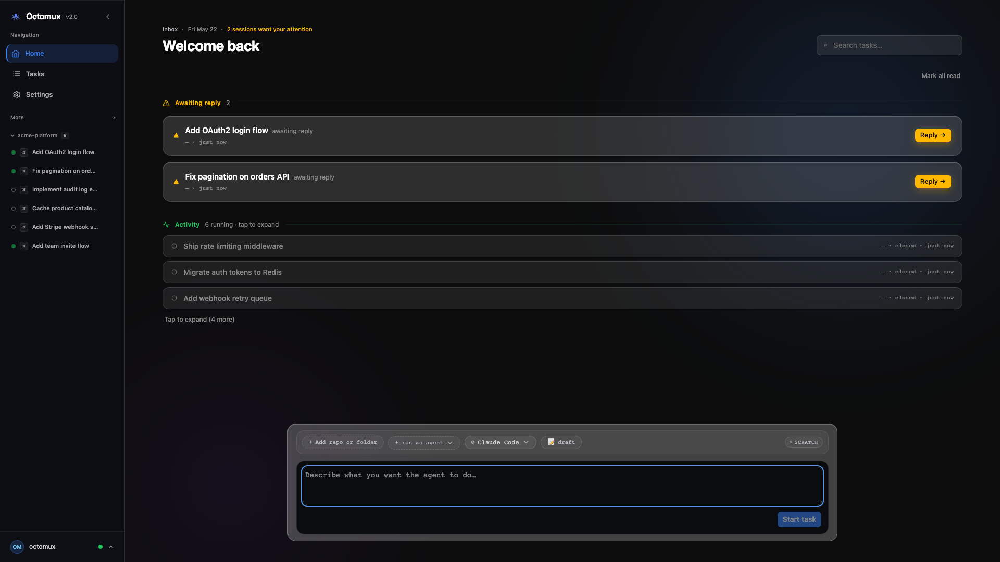
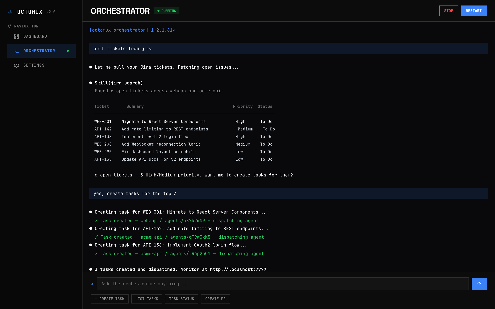
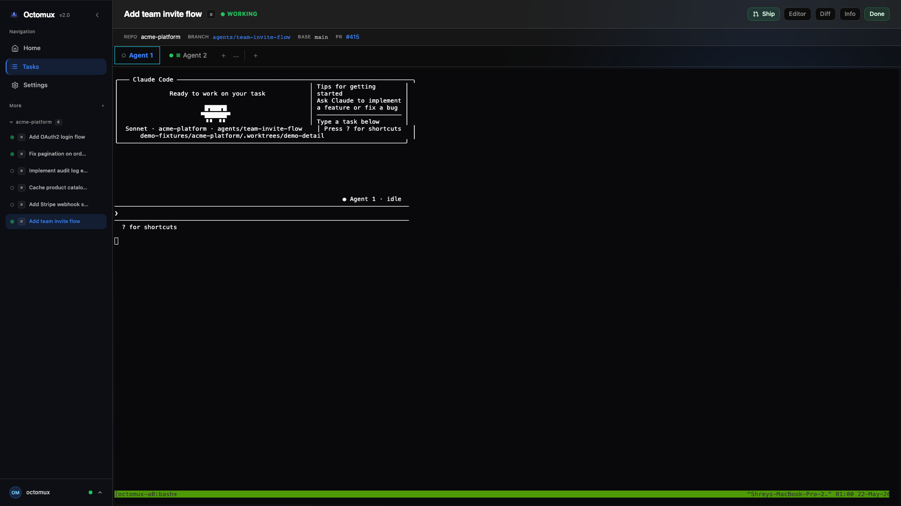
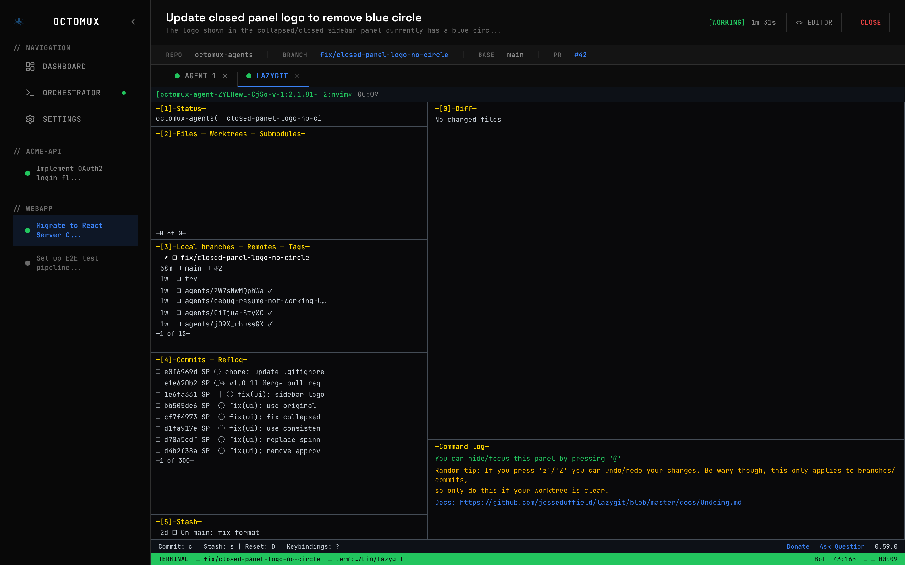
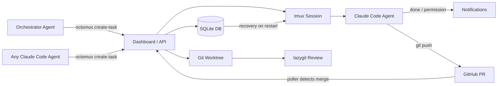

[](https://www.npmjs.com/package/octomux)
[](LICENSE)
[](https://github.com/ShreyPaharia/octomux)

# octomux

**Your local command center for autonomous Claude Code agents.**

Pull tasks from Jira, GitHub, or any source your agent can read. Agents work in isolated worktrees. Get notified when they need you. PRs auto-link and tasks auto-close on merge. Review diffs with built-in lazygit. Survives restarts.



## The Loop

```
1. INTAKE      Pull Jira tickets or GitHub issues — auto-creates tasks with prompts
2. EXECUTE     Each task gets its own worktree, branch, and Claude Code agents
3. SUPERVISE   Live terminals + notifications when agents finish or need attention
4. REVIEW      Built-in lazygit & lazyvim — check diffs without leaving octomux
5. MERGE       PRs auto-detected and linked — tasks auto-close when PRs merge
6. RESUME      Close your laptop. Reboot. Everything picks back up automatically.
```

> The orchestrator agent can drive this entire loop autonomously — or you can control each step from the CLI and dashboard.

## Features

### Orchestrator: agents managing agents

A dedicated Claude Code instance that orchestrates your entire workflow. Create tasks, monitor status, add agents, create PRs — all via slash commands (`/create-task`, `/list-tasks`, `/status`, `/create-pr`).

Wire it to Jira MCP, GitHub CLI, or any source — the orchestrator pulls context and creates properly named tasks with initial prompts. Ships with Claude Code skills (`create-task`, `create-pr`, `create-commit`) that any agent can use directly.



### Intake from anywhere

- Any Claude Code agent can create tasks via `octomux create-task`
- Works with Jira MCP, GitHub CLI, or anything your agent can read
- Auto-generates task names and initial prompts from ticket context
- Draft tasks: create in draft mode, edit title/prompt/branch before starting

### Isolated execution

- Each task gets its own git worktree, branch, and tmux session
- Multiple agents per task, working in parallel
- Custom base branches supported (work from `develop`, not just `main`)
- Your main working tree stays untouched

### Smart supervision

- Live terminals in the dashboard via xterm.js
- Color-coded agent activity: green (active), gray (idle), amber (waiting for input)
- Notifications when agents finish, stop unexpectedly, or hit permission prompts
- Browser tab shows `(N) octomux` + red favicon dot when tasks need attention
- Toast notifications with "View" button — one click to the relevant agent
- Send messages to running agents via `octomux send-message`
- Smart status: tasks needing attention surface before idle tasks



### Built-in review

- Lazygit and lazyvim integrated — review diffs inside octomux
- Open ad-hoc shell terminals in any task's worktree from the dashboard
- No context switching to a separate terminal or IDE
- Clean branches ready to push and PR when you're satisfied



### Auto PR detection + merge

- Background poller detects PRs on task branches via `gh pr list`
- PR URLs auto-linked in task cards — visible from the dashboard
- Tasks auto-close when their PRs are merged
- Zero manual status updates from task creation to merged code

### Survives restarts

- Full state persistence in SQLite across reboots
- On next `octomux start`, running tasks are recovered and agent sessions resume
- Close your laptop, come back tomorrow, run `octomux start`, keep going

### Safety: graduated trust

Each task worktree gets a permission config (`.claude/settings.local.json`) with three tiers:

- **Denied**: `git push --force`, `rm -rf`, `git reset --hard` — always blocked
- **Allowed**: read-only ops, safe writes, non-force `git push` — auto-approved
- **Prompted**: everything else requires explicit user permission

Permission prompts surface in the dashboard with tool name and input details. Agents can't destroy things without asking first.

## Quick Start

```bash
npm install -g octomux
cd your-project
octomux start                                    # opens dashboard at localhost:7777
octomux create-task -t "Add auth flow" -r .      # create a task from the CLI
```

Open [http://localhost:7777](http://localhost:7777) to watch agents work, or keep using the CLI.

## CLI Commands

| Command                                           | Description                                     |
| ------------------------------------------------- | ----------------------------------------------- |
| `octomux start`                                   | Launch the local web dashboard                  |
| `octomux create-task`                             | Create a new task                               |
| `octomux list-tasks`                              | List all tasks                                  |
| `octomux get-task <id>`                           | Get task details                                |
| `octomux close-task <id>`                         | Stop agents and preserve the worktree           |
| `octomux delete-task <id>`                        | Fully clean up task state, branch, and worktree |
| `octomux resume-task <id>`                        | Resume a previously closed task                 |
| `octomux add-agent <task-id>`                     | Add an agent to an existing task                |
| `octomux send-message <task-id> <agent-id> "msg"` | Send a message to an agent                      |

## Why octomux?

|                      | Without octomux          | With octomux                             |
| -------------------- | ------------------------ | ---------------------------------------- |
| Git isolation        | Manual worktrees         | Automatic per task                       |
| Agent visibility     | Tab-switching            | Single dashboard with activity dots      |
| Backlog intake       | Copy-paste prompts       | Agent-driven from Jira/GH                |
| PR tracking          | Manual                   | Auto-detected and linked                 |
| Task completion      | Manual status updates    | Auto-closes on PR merge                  |
| After a reboot       | Start over               | Auto-resumes                             |
| Reviewing changes    | Switch to terminal + git | Built-in lazygit                         |
| Agent safety         | Hope for the best        | Graduated trust: denied/allowed/prompted |
| Lifecycle management | None                     | draft → running → closed                 |

## How It Works



## Requirements

- **macOS** (ARM64 or x64)
- **Node.js 20+**
- **tmux**: `brew install tmux`
- **git**: `brew install git`
- **Claude Code CLI**: `npm install -g @anthropic-ai/claude-code`

> Xcode Command Line Tools (`xcode-select --install`) may be needed if native dependencies (`better-sqlite3`, `node-pty`) require local compilation.

## Configuration

| Option          | Description                     | Default                 |
| --------------- | ------------------------------- | ----------------------- |
| `--port <port>` | Port for the dashboard          | `7777`                  |
| `--no-open`     | Do not auto-open the browser    | —                       |
| `PORT`          | Alternative to `--port`         | `7777`                  |
| `OCTOMUX_URL`   | Server URL used by CLI commands | `http://localhost:7777` |

## Links

- GitHub: [github.com/ShreyPaharia/octomux](https://github.com/ShreyPaharia/octomux)
- npm: [npmjs.com/package/octomux](https://www.npmjs.com/package/octomux)
- Landing page: [octomux.com](https://octomux.com)

Contributions welcome — [open an issue](https://github.com/ShreyPaharia/octomux/issues) or submit a PR.
