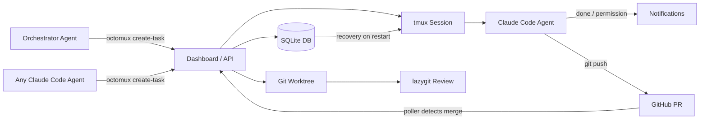

# README Redesign Spec

## Goal

Redesign the octomux README.md to better communicate the product's value, showcase
differentiating features, and follow devtools marketing best practices. The current
README reads like technical documentation. The new one should read like a compelling
pitch backed by technical substance.

## Core Positioning

**octomux is a local command center for autonomous Claude Code agents.**

The narrative spine is a 6-step loop that tells the complete story:

```
INTAKE → EXECUTE → SUPERVISE → REVIEW → MERGE → RESUME
```

This positions octomux not as "a nicer way to run multiple agents" but as a
**complete agentic development workflow** — from backlog to merged PR, with
an orchestrator agent that can drive the entire loop autonomously.

## Key Differentiators to Showcase

These features are currently absent from the README and represent octomux's strongest
selling points:

1. **Orchestrator agent** — A meta-agent (Claude Code instance) that can create tasks,
   monitor status, add agents, and create PRs. Agents managing agents. Accessible via
   the Orchestrator page in the dashboard with slash commands (`/create-task`,
   `/list-tasks`, `/status`, `/create-pr`).

2. **Agent-driven intake** — Any Claude Code agent can pull Jira tickets, GitHub issues,
   or any other source via MCP/CLI and create octomux tasks with proper naming and
   initial prompts. The intake layer is composable, not hardcoded to any specific tool.
   Ships with Claude Code skills (`create-task`, `create-pr`, `create-commit`) that
   agents can use directly.

3. **Auto PR detection + merge auto-close** — A background poller checks `gh pr list`
   every 30 seconds, automatically links PRs to tasks in the dashboard, and auto-closes
   tasks when their PRs are merged. Zero manual status updates from task to merged code.

4. **Graduated trust model** — Each task worktree gets a `.claude/settings.local.json`
   with three tiers: DENIED tools (force push, rm -rf, reset --hard — always blocked),
   ALLOWED tools (read-only ops, safe writes, and non-force `git push` — auto-approved),
   and everything else prompts for permission. Safety without slowness.

5. **Smart notifications** — Agents notify the user when they finish, stop unexpectedly,
   or hit permission/question prompts. Browser tab shows `(N) octomux` with a red
   favicon dot when tasks need attention. Each toast notification has a "View" button
   that navigates directly to the relevant agent. The user supervises instead of
   babysitting.

6. **State persistence + auto-resume** — Full state survives reboots. On next
   `octomux start`, running tasks are automatically recovered and agent sessions
   resume from where you left off.

7. **Built-in review tools** — Lazygit and lazyvim are integrated for reviewing diffs
   inside octomux. Ad-hoc shell terminals can be opened in any task's worktree from
   the dashboard. No context switching to a separate terminal or IDE.

## README Structure

### Section 1: Badges Row

Inline badge images for: npm version, MIT license, GitHub stars, macOS, Claude Code
compatible.

```markdown
[](https://www.npmjs.com/package/octomux)
[](LICENSE)
[](https://github.com/ShreyPaharia/octomux)
```

### Section 2: Hero

```markdown
# octomux

Your local command center for autonomous Claude Code agents.

Pull tasks from Jira, GitHub, or any source your agent can read. Agents work
in isolated worktrees. Get notified when they need you. PRs auto-link and
tasks auto-close on merge. Review diffs with built-in lazygit. Survives restarts.
```

Followed by a single hero screenshot — the dashboard with 3-4 active tasks in
different states, showing activity dots and PR links.

**Placeholder:** ``

### Section 3: The Loop (Narrative Centerpiece)

A visual or formatted representation of the 6-step agentic development loop:

```
1. INTAKE      Pull Jira tickets or GitHub issues — auto-creates tasks with prompts
2. EXECUTE     Each task gets its own worktree, branch, and Claude Code agents
3. SUPERVISE   Live terminals + notifications when agents finish or need attention
4. REVIEW      Built-in lazygit & lazyvim — check diffs without leaving octomux
5. MERGE       PRs auto-detected and linked — tasks auto-close when PRs merge
6. RESUME      Close your laptop. Reboot. Everything picks back up automatically.
```

Below the loop, a single sentence:

> The orchestrator agent can drive this entire loop autonomously —
> or you can control each step from the CLI and dashboard.

This is the "10-second pitch." Every feature maps to a step. A reader who only
scans this section understands the full product.

### Section 4: Feature Sections

One subsection per loop step plus two cross-cutting sections (orchestrator, safety).

#### Orchestrator: agents managing agents

- A dedicated Claude Code instance that orchestrates your entire workflow
- Create tasks, monitor status, add agents, create PRs — all via slash commands
- Wire it to Jira MCP, GitHub CLI, or any source — the orchestrator pulls context
  and creates properly named tasks with initial prompts
- Ships with Claude Code skills (`create-task`, `create-pr`, `create-commit`)
  that any agent can use

**Screenshot:** Orchestrator page with command bar and slash commands.

#### Intake from anywhere

- Any Claude Code agent can create tasks via `octomux create-task`
- Works with Jira MCP, GitHub CLI, or anything your agent can read
- Auto-generates task names and initial prompts from ticket context
- Draft tasks: create in draft mode, edit title/prompt/branch before starting

#### Isolated execution

- Each task gets its own git worktree, branch, and tmux session
- Multiple agents per task, working in parallel
- Custom base branches supported (work from `develop`, not just `main`)
- Your main working tree stays untouched

#### Smart supervision

- Live terminals in the dashboard (xterm.js)
- Color-coded agent activity: green (active), gray (idle), amber (waiting for input)
- Notifications when agents finish, stop unexpectedly, or hit permission prompts
- Browser tab shows `(N) octomux` + red favicon dot when tasks need attention
- Toast notifications with "View" button — one click to the relevant agent
- Send messages to running agents via `octomux send-message`
- Smart status derivation: tasks needing attention surface before idle tasks

**Screenshot:** Task detail page with live terminal, activity dots, and notification.

#### Built-in review

- Lazygit and lazyvim integrated — review diffs inside octomux
- Open ad-hoc shell terminals in any task's worktree from the dashboard
- No context switching to a separate terminal or IDE
- Clean branches ready to push and PR when you're satisfied

**Screenshot:** Lazygit diff review inside octomux.

#### Auto PR detection + merge

- Background poller detects PRs on task branches via `gh pr list`
- PR URLs auto-linked in task cards — visible from the dashboard
- Tasks auto-close when their PRs are merged
- Zero manual status updates from task creation to merged code

#### Survives restarts

- Full state persistence in SQLite across reboots
- On next `octomux start`, running tasks are recovered and agent sessions resume
- Close your laptop, come back tomorrow, run `octomux start`, keep going

#### Safety: graduated trust

- Each task worktree gets `.claude/settings.local.json` with three tiers:
  - **Denied**: `git push --force`, `rm -rf`, `git reset --hard` — always blocked
  - **Allowed**: read-only ops, safe writes, non-force `git push` — auto-approved
  - **Prompted**: everything else requires explicit user permission
- Permission prompts surface in the dashboard with tool name and input details
- Agents can't destroy things without asking first

### Section 5: Quick Start

```bash
npm install -g octomux
cd your-project
octomux start                                    # opens dashboard at localhost:7777
octomux create-task -t "Add auth flow" -r .      # create a task from the CLI
```

Then: "Open http://localhost:7777 to watch agents work, or keep using the CLI."

### Section 6: Dashboard Preview

3-4 annotated screenshots showing:

1. Dashboard overview with task cards, activity dots, and PR links
2. Task detail with live agent terminal and activity states
3. Lazygit review view
4. Orchestrator page with command bar

These use `` tags with alt text and optional captions.

### Section 7: CLI Reference

Keep the existing CLI command table as-is. It's clean and scannable.

| Command                                           | Description                                     |
| ------------------------------------------------- | ----------------------------------------------- |
| `octomux start`                                   | Launch the local web dashboard                  |
| `octomux create-task`                             | Create a new task                               |
| `octomux list-tasks`                              | List all tasks                                  |
| `octomux get-task <id>`                           | Get task details                                |
| `octomux close-task <id>`                         | Stop agents and preserve the worktree           |
| `octomux delete-task <id>`                        | Fully clean up task state, branch, and worktree |
| `octomux resume-task <id>`                        | Resume a previously closed task                 |
| `octomux add-agent <task-id>`                     | Add an agent to an existing task                |
| `octomux send-message <task-id> <agent-id> "msg"` | Send a message to an agent                      |

### Section 8: Before/After Comparison

A table contrasting workflow without octomux vs. with octomux:

|                      | Without octomux          | With octomux                                       |
| -------------------- | ------------------------ | -------------------------------------------------- |
| Git isolation        | Manual worktrees         | Automatic per task                                 |
| Agent visibility     | Tab-switching            | Single dashboard with activity dots                |
| Backlog intake       | Copy-paste prompts       | Agent-driven from Jira/GH                          |
| PR tracking          | Manual                   | Auto-detected and linked                           |
| Task completion      | Manual status updates    | Auto-closes on PR merge                            |
| After a reboot       | Start over               | Auto-resumes                                       |
| Reviewing changes    | Switch to terminal + git | Built-in lazygit                                   |
| Agent safety         | Hope for the best        | Graduated trust with denied/allowed/prompted tiers |
| Lifecycle management | None                     | draft → running → closed                           |

### Section 9: How It Works (Architecture)

A Mermaid diagram showing the system architecture including the orchestrator,
PR detection, and persistence:



### Section 10: Requirements

Condensed from current README. Keep it factual, move it lower since it's not
the first thing people need to see.

- macOS (ARM64 or x64)
- Node.js 20+
- tmux, git
- Claude Code CLI

Note: Xcode Command Line Tools may be needed if native dependencies
(`better-sqlite3`, `node-pty`) require local compilation.

### Section 11: Configuration

Keep existing configuration table. Compact.

| Option          | Description                     | Default                 |
| --------------- | ------------------------------- | ----------------------- |
| `--port <port>` | Port for the dashboard          | `7777`                  |
| `--no-open`     | Do not auto-open the browser    | —                       |
| `PORT`          | Alternative to `--port`         | `7777`                  |
| `OCTOMUX_URL`   | Server URL used by CLI commands | `http://localhost:7777` |

### Section 12: Contributing + Links

End on an inviting note, not limitations. Move the "macOS only" note into
Requirements (section 10) rather than giving it its own negative section.

- GitHub link
- npm link
- Landing page link
- "Contributions welcome" with link to issues

## Screenshots to Capture

Priority-ordered list of screenshots needed before the README can ship:

| Priority | Screenshot                                               | Source Component                                                   | Purpose                                 |
| -------- | -------------------------------------------------------- | ------------------------------------------------------------------ | --------------------------------------- |
| P0       | Dashboard with 3-4 active tasks, activity dots, PR links | `Dashboard.tsx` + `TaskCard.tsx`                                   | Hero image                              |
| P0       | Task detail with live terminal + activity states         | `TaskDetail.tsx` + `TerminalView.tsx` + `AgentActivityDot.tsx`     | Feature: supervision                    |
| P0       | Orchestrator page with command bar                       | `OrchestratorPage.tsx` + `OrchestratorCommandBar.tsx`              | Feature: orchestrator                   |
| P1       | Lazygit diff review                                      | Built-in lazygit via LazyVim                                       | Feature: review (unique differentiator) |
| P1       | Notification toast + permission prompt                   | `use-notifications.ts` + sonner toasts + `PermissionPromptRow.tsx` | Feature: smart supervision + safety     |
| P1       | Browser tab with attention indicator                     | `use-attention-indicator.ts`                                       | Feature: passive monitoring             |
| P2       | Create task dialog / draft edit form                     | `CreateTaskDialog.tsx` + `DraftEditForm.tsx`                       | Feature: draft tasks                    |
| P2       | Architecture diagram                                     | Mermaid (rendered by GitHub)                                       | How it works                            |

Screenshots should be captured from a running dashboard with realistic-looking
tasks (real Jira ticket names, real prompts) to feel authentic rather than staged.

Recommended dimensions: 1200px wide, dark theme only (matches the product's
primary aesthetic), retina (2x).

## What Gets Removed

- "Current Limitations" section — macOS-only note moves to Requirements
- "Why not just use multiple terminals?" section — replaced by stronger
  before/after comparison table
- "Who this is for" section — the loop narrative makes this self-evident
- "May Be Required During Install" section — fold into Requirements as a
  sub-note

## What Stays

- CLI command table (as-is)
- Configuration table (as-is, now included in spec)
- Quick Start commands (4 lines with CLI task creation)
- Links section (moved to end)

## Success Criteria

- A developer landing on the README understands the full value prop in <10 seconds
  (the loop section)
- The orchestrator agent is prominently featured as the headline differentiator
- Screenshots show real product, not placeholder art
- The README tells a story (intake → execute → supervise → review → merge → resume)
  rather than listing features
- Badges provide social proof at a glance
- Safety story (graduated trust) is visible — answers the "aren't agents dangerous?" objection
- Auto PR detection + merge auto-close demonstrates end-to-end automation
- No section ends on a negative note
